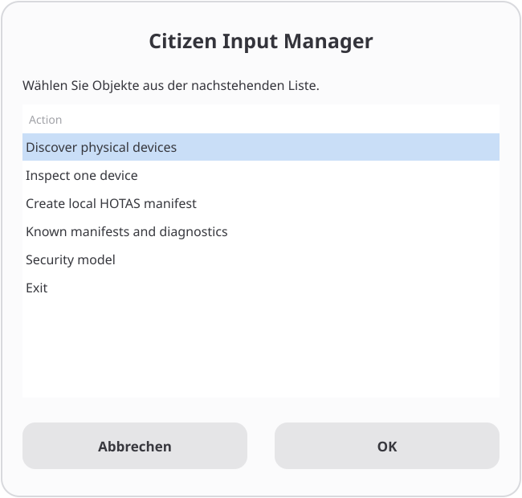

# Star Citizen Linux Input

Citizen Input Manager is a security-focused Linux tool for discovering,
grouping, diagnosing, and describing joysticks, HOTAS components, throttles,
rudder pedals, SpaceMouse devices, button boxes, and related USB HID input
hardware. Its command-line interface is `sc-input`; its graphical entry point
is `sc-input-gui`.


Native hardware discovery is separate from Wine and game behavior. Citizen
Input Manager reports every diagnostic stage independently and never infers a
later status from native detection. Scoped Udev rendering addresses one access
boundary; it does not guarantee Wine visibility, binding, or gameplay.

## Prerequisites and installation paths

| Goal | Required | Not required at this stage |
| --- | --- | --- |
| Read-only CLI with `nix run` | Linux, Nix, Flakes enabled, connected USB HID controller | Root, Wine, Star Citizen, Home Manager, LUG Helper, nix-citizen |
| Packaged GUI | Same as above plus a graphical desktop session | Manual installation of Zenity, `jq`, Python, or Udev tools |
| NixOS hardware integration | NixOS Flake configuration, NixOS system module, known or local manifest, root for `nixos-rebuild` | Home Manager is optional and cannot replace the system module |
| Home Manager package installation | Home Manager and the Flake input | System Udev rules; those still require the NixOS module |
| Direct Git checkout | Bash and the command set documented for generic Linux | This is the advanced path; Nix packaging is recommended |

When used through Nix, the package supplies its runtime dependencies,
including the `acl`, coreutils, findutils, `gawk`, grep, sed, `jq`, libxml2,
Python, systemd/Udev, and util-linux command sets. The GUI package also supplies
Zenity and `dialog`.

Wine and Star Citizen are required only for their later diagnostic stages.
LUG Helper and nix-citizen are related community projects, not runtime
dependencies of Citizen Input Manager.

Start with the complete [Getting started guide](docs/getting-started.md). It
covers prerequisites, GUI manifest creation, simple and modular NixOS layouts,
Home Manager boundaries, rebuilds, and post-installation verification.

## Architecture

- `sc-input` is the only device-discovery backend and provides JSON output.
- `sc-input-gui` consumes backend JSON through Zenity, then `dialog` or
  `whiptail`; it contains no independent hardware-discovery code.
- Versioned JSON manifests describe stable USB identities and multi-device
  groups without runtime paths or serial numbers.
- The Udev renderer emits only device-scoped HIDRAW `uaccess` rules.
- The NixOS module reads the same manifest model and uses
  `services.udev.packages`.

See [Architecture](docs/architecture.md) for trust boundaries and the status
pipeline.

## Security model

Discovery is bounded to `/sys/class/hidraw`, `/sys/class/input`, matching device
nodes, and `/proc/bus/input/devices`. USB identity is confirmed by walking at
most 32 parents to readable `idVendor` and `idProduct` attributes.

The project never grants global HIDRAW or input access, changes group
membership, writes persistent ACLs, launches Wine or Star Citizen, edits Wine
registry values, or changes controller bindings. Rendering a rule is not an
installation.

Read [Security model](docs/security-model.md) before using imperative installer
code outside an isolated fixture.

## Read-only quick start

No repository clone is required:

```console
nix run github:ewilhelm1979-netizen/starcitizen-linux-input -- discover

nix run github:ewilhelm1979-netizen/starcitizen-linux-input -- \
  manifest show 3dconnexion-spacemouse-wireless-usb

nix run github:ewilhelm1979-netizen/starcitizen-linux-input -- \
  udev render --known-manifest 3dconnexion-spacemouse-wireless-usb
```

The third command only prints a rule. It does not write under `/etc`, reload
Udev, trigger hardware, or change a device permission.

## Citizen Input Manager GUI

```console
nix run github:ewilhelm1979-netizen/starcitizen-linux-input#gui
```



*The main GUI offers discovery, inspection, grouped manifest creation, diagnostics, and security guidance.*

The packaged GUI supplies the CLI, Zenity, and `dialog`. It can list and
inspect devices, group multiple devices into a local manifest, preview the
manifest and Udev rule, display a safe dry-run command, run native diagnosis,
and export a public report. It never asks for a password or performs a
privileged change.

For a multi-component HOTAS, hold **Ctrl** while selecting non-adjacent device
rows such as the throttle and stick. Create one grouped manifest for the
complete set. See [GUI and TUI](docs/gui.md).

## Create a manifest

A manifest may describe one physical device or a grouped set of HOTAS
components. Every selected device requires one unique role, and role order must
match the selected device order.

### Single device

```console
runtime_id=$(sc-input discover --json | jq -er '.devices[0].runtimeId')

sc-input manifest create \
  --devices "$runtime_id" \
  --id my-controller \
  --display-name 'My Controller' \
  --roles controller \
  --preview
```

### X-56 stick and throttle

Select both devices in the same GUI dialog:

- throttle: `0738:a221`;
- stick: `0738:2221`.

If the throttle row appears first:

```text
Safe slug id: saitek-x56-rhino-local
Display name: Saitek X-56 Rhino
Roles, comma-separated: throttle,stick
```

If the stick row appears first, use `stick,throttle`. Confirm the mapping in the
preview before saving. A newly generated local manifest still starts with
`unverified` support fields; this does not downgrade the separately reviewed
and tested bundled `saitek-x56-rhino` manifest.

The GUI saves private local manifests under:

```text
${XDG_DATA_HOME:-$HOME/.local/share}/starcitizen-linux-input/manifests/
```

Read [Device manifests](docs/device-manifests.md) for validation and storage
rules.

## X-56 validated support

On 2026-08-03, the human maintainer completed a live X-56 test on NixOS 26.05
with nix-citizen and an Astral Wine/Proton runtime. Native Linux detected the
stick and throttle separately with working axes and buttons. Star Citizen
listed both devices as enabled and connected, and both supplied usable in-game
input after loading the standard CIG X-56 profile.

The standard CIG profile proved functionality but its default mapping was not
optimal and still needs user-specific binding adjustments. Native Linux, Wine,
and Star Citizen are therefore `tested` for the bundled X-56 manifest. HIDRAW
`uaccess` remains `candidate` because successful gameplay does not by itself
prove that the scoped HIDRAW policy was the necessary causal mechanism.

See the [X-56 functional validation](docs/research/x56-functional-validation.md)
and [support matrix](docs/support-matrix.md) for the exact evidence and
limitations.

## Use a local manifest on NixOS

The recommended modular setup uses **three different files with three different
jobs**. Do not paste all blocks into `configuration.nix`.

For the tested bundled X-56 manifest, the shortest configuration is:

```nix
hardware.starCitizenInput = {
  enable = true;
  knownManifests = [ "saitek-x56-rhino" ];
  manifestFiles = [ ];
  diagnosticTools = true;
  gui = true;
};
```

Use the local-manifest workflow below when you intentionally want a reviewed
custom copy. Do not enable both sources for the same VID:PID pairs.

### File 1: `/etc/nixos/flake.nix`

This file declares the GitHub input and imports the NixOS module.

Add `star-citizen-input` **inside the existing top-level `inputs = { ... };`
block**:

```nix
# /etc/nixos/flake.nix
{
  inputs = {
    # Keep your existing inputs here.
    nixpkgs.url = "github:NixOS/nixpkgs/nixos-unstable";

    star-citizen-input = {
      url = "github:ewilhelm1979-netizen/starcitizen-linux-input";
      inputs.nixpkgs.follows = "nixpkgs";
    };
  };

  outputs = { self, nixpkgs, ... }@inputs: {
    nixosConfigurations.nixos = nixpkgs.lib.nixosSystem {
      system = "x86_64-linux";

      # Keep your existing specialArgs here.
      specialArgs = { inherit inputs; };

      modules = [
        # Import the Citizen Input Manager NixOS module exactly once.
        inputs.star-citizen-input.nixosModules.default

        # Keep your existing host configuration import.
        ./hosts/nixos/configuration.nix
      ];
    };
  };
}
```

The `star-citizen-input = { ... };` block belongs in `inputs`. The
`inputs.star-citizen-input.nixosModules.default` line belongs in the
`modules = [ ... ];` list of `nixosSystem` in the same `flake.nix` file.

Do **not** put the Flake input in `configuration.nix`. Do **not** create a second
`modules = [ ... ];` block in `configuration.nix`.

### File 2: `/etc/nixos/hosts/nixos/configuration.nix`

This file configures the imported module. When the file already has a
`hardware = { ... };` block, add only `starCitizenInput = { ... };` inside that
existing block:

```nix
# /etc/nixos/hosts/nixos/configuration.nix
{
  # Existing configuration continues above.

  hardware = {
    enableRedistributableFirmware = true;

    # Add this block inside the existing hardware attribute set.
    starCitizenInput = {
      enable = true;
      knownManifests = [ ];
      manifestFiles = [
        ./manifests/saitek-x56-rhino-local.json
      ];
      diagnosticTools = true;
      gui = true;
    };

    # Existing Bluetooth, NVIDIA, graphics, controller, and scanner settings
    # continue here.
  };
}
```

Inside `hardware = { ... };`, write `starCitizenInput = { ... };`, not
`hardware.starCitizenInput = { ... };`.

For a configuration without an existing `hardware = { ... };` block, the
following top-level form is equivalent:

```nix
# /etc/nixos/hosts/nixos/configuration.nix
hardware.starCitizenInput = {
  enable = true;
  knownManifests = [ ];
  manifestFiles = [
    ./manifests/saitek-x56-rhino-local.json
  ];
  diagnosticTools = true;
  gui = true;
};
```

### File 3: the local manifest JSON

Because the relative path is written in
`/etc/nixos/hosts/nixos/configuration.nix`, this entry:

```nix
./manifests/saitek-x56-rhino-local.json
```

resolves to exactly:

```text
/etc/nixos/hosts/nixos/manifests/saitek-x56-rhino-local.json
```

Copy the reviewed GUI output there:

```console
sudo mkdir -p /etc/nixos/hosts/nixos/manifests
sudo cp \
  "${XDG_DATA_HOME:-$HOME/.local/share}/starcitizen-linux-input/manifests/saitek-x56-rhino-local.json" \
  /etc/nixos/hosts/nixos/manifests/
```

Do not also enable the bundled `saitek-x56-rhino` manifest when the local file
describes the same USB identities.

Validate, switch, and reconnect the controller components:

```console
sudo nixos-rebuild dry-build --flake /etc/nixos#nixos
sudo nixos-rebuild switch --flake /etc/nixos#nixos
```

Then verify native discovery and access again. Read [NixOS](docs/nixos.md) for
the complete Flake, modular host, Home Manager, and troubleshooting examples.

## Udev rule preview

```console
sc-input udev render --known-manifest 3dconnexion-spacemouse-wireless-usb
sc-input udev render --known-manifest saitek-x56-rhino
```

The SpaceMouse rule is backed by a tested reference. The bundled X-56 manifest
is tested for native Linux, Wine, and Star Citizen in the documented maintainer
environment. Its scoped HIDRAW `uaccess` status remains `candidate` until that
mechanism is independently verified rather than inferred from gameplay.

## Diagnostic stages

Citizen Input Manager keeps the following states separate:

1. native Linux detection;
2. effective native access;
3. Wine visibility;
4. Star Citizen visibility;
5. binding confirmation;
6. gameplay confirmation.

Use [Wine diagnostics](docs/wine-diagnostics.md) and
[Star Citizen diagnostics](docs/star-citizen-diagnostics.md) only after native
discovery and access are understood.

## Generic Linux

The Nix package is the recommended dependency-complete path. Direct checkout
execution requires the commands listed in [Generic Linux](docs/generic-linux.md).
The imperative installer performs no privilege escalation, Udev reload, or
device trigger.

## Related Star Citizen Linux projects

Citizen Input Manager complements the existing Star Citizen Linux community
tooling:

- [LUG Helper](https://github.com/starcitizen-lug/lug-helper) is the official
  installer maintained by the Star Citizen Linux Users Group and community. It
  covers broader installation, Wine-runner management, system preparation,
  maintenance, and general troubleshooting workflows.
- [nix-citizen](https://github.com/LovingMelody/nix-citizen) provides
  NixOS-oriented Star Citizen packages, including LUG Helper and
  `wine-astral`.

Citizen Input Manager is maintained independently; no affiliation or endorsement is implied.

## Support boundaries

- SpaceMouse Wireless USB `256f:c63a` is the tested reference: NixOS 26.05,
  nix-citizen, Astral Wine 11.12, Star Citizen LIVE 4.9.188.23497, six axes,
  flight and shared ground-vehicle movement, no drift or cross-axis input.
  Bluetooth and Universal Receiver operation remain unverified.
- X-56 stick `0738:2221` and throttle `0738:a221` are tested in the documented
  maintainer environment for native Linux detection and input, Wine
  presentation, Star Citizen visibility, and usable in-game axes and controls.
  The standard CIG profile requires binding adjustments and the HIDRAW
  `uaccess` mechanism remains a separately tracked candidate.
- The tool does not change Wine registry settings, Wine runners, or Star
  Citizen bindings and does not distribute controller profiles.

Read [Support matrix](docs/support-matrix.md), the
[SpaceMouse case study](docs/research/spacemouse-case-study.md), the
[X-56 functional validation](docs/research/x56-functional-validation.md), and
the [X-56 issue research summary](docs/research/nix-citizen-issue-108.md).

## Documentation

- [Getting started](docs/getting-started.md)
- [Architecture](docs/architecture.md)
- [Security model](docs/security-model.md)
- [GUI and TUI](docs/gui.md)
- [Device manifests](docs/device-manifests.md)
- [NixOS](docs/nixos.md)
- [Generic Linux](docs/generic-linux.md)
- [Troubleshooting](docs/troubleshooting.md)
- [Wine diagnostics](docs/wine-diagnostics.md)
- [Star Citizen diagnostics](docs/star-citizen-diagnostics.md)
- [Support matrix](docs/support-matrix.md)
- [X-56 functional validation](docs/research/x56-functional-validation.md)

## Development

```console
nix develop
tests/run.sh
nix flake check --no-write-lock-file
nix build .#packages.x86_64-linux.default
nix build .#packages.x86_64-linux.gui
```

See [CONTRIBUTING.md](CONTRIBUTING.md) and [SECURITY.md](SECURITY.md).

## AI-assisted development

This project was developed with substantial assistance from OpenAI Codex.
The human maintainer remains responsible for architecture, implementation
review, security decisions, testing, licensing, provenance, and releases.

## License

GPL-3.0-only. The original [LICENSE](LICENSE) file remains unchanged.
