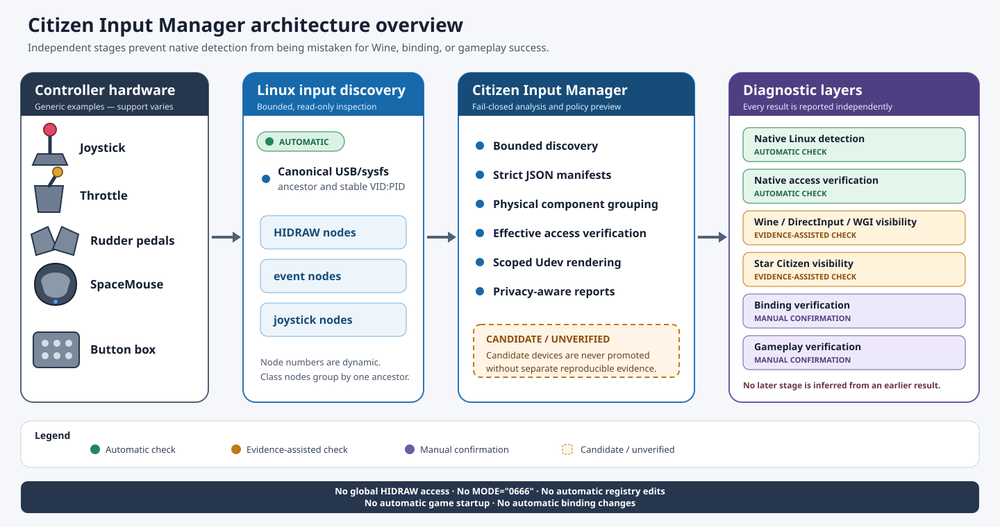

# Architecture

The figure summarizes the path from generic controller hardware through
bounded Linux discovery and Citizen Input Manager to separately evidenced Wine
and Star Citizen diagnostic stages. The detailed trust and state boundaries
remain authoritative below.

## Ecosystem context

[LUG Helper](https://github.com/starcitizen-lug/lug-helper) is the broader
community installer and management tool for Star Citizen on Linux, while
[nix-citizen](https://github.com/LovingMelody/nix-citizen) provides a
NixOS-oriented package environment. Citizen Input Manager remains an
independently maintained diagnostic layer for controller discovery, grouping,
access verification, scoped Udev rendering, and diagnostic-state separation.

The references are documentation links only. Citizen Input Manager has no
runtime, evaluation-time, build-time, or Flake dependency on either project
and no coupling that modifies either project automatically.

Citizen Input Manager separates five concerns:

1. `sc-input` owns bounded discovery, grouping, validation, rule rendering, and
   diagnostics.
2. `sc-input-gui` presents only machine-readable backend results.
3. Zenity is preferred; `dialog` and `whiptail` provide a terminal fallback.
4. JSON manifests store stable USB identity and support claims.
5. The NixOS module renders the same scoped policy declaratively.

Discovery considers only HIDRAW and input class links and their matching device
nodes. Each class link is resolved, checked against the selected sysfs root,
and walked upward for no more than 32 levels. The first valid USB ancestor with
four-digit lowercase `idVendor` and `idProduct` attributes becomes the physical
group key. Multiple interfaces and HIDRAW, event, and joystick nodes then join
that group.

The runtime ID is a local hash of the canonical USB ancestor. It permits exact
selection during one run but is deliberately absent from saved manifests.
Multiple devices with the same VID:PID are reported as ambiguous because a
VID:PID rule necessarily applies to every identical unit.

The diagnostic state pipeline is:

- `NATIVE_DETECTED`: automatic component and expected-node discovery.
- `NATIVE_ACCESS_OK`: automatic effective native access checks.
- `WINE_VISIBLE`: explicit manual confirmation only.
- `STAR_CITIZEN_VISIBLE`: explicit Game.log analysis or manual confirmation.
- `STAR_CITIZEN_BINDING_VERIFIED`: explicit manual confirmation only.
- `STAR_CITIZEN_GAMEPLAY_VERIFIED`: explicit manual confirmation only.

No later state is derived from an earlier state. In particular, native access
does not prove Wine visibility, binding behavior, or gameplay operation.
The `--confirm` option can mark one or more manual states in the current verify
or report output after explicit user confirmation. Confirmations are never
stored and cannot override the two automatically measured native states.
